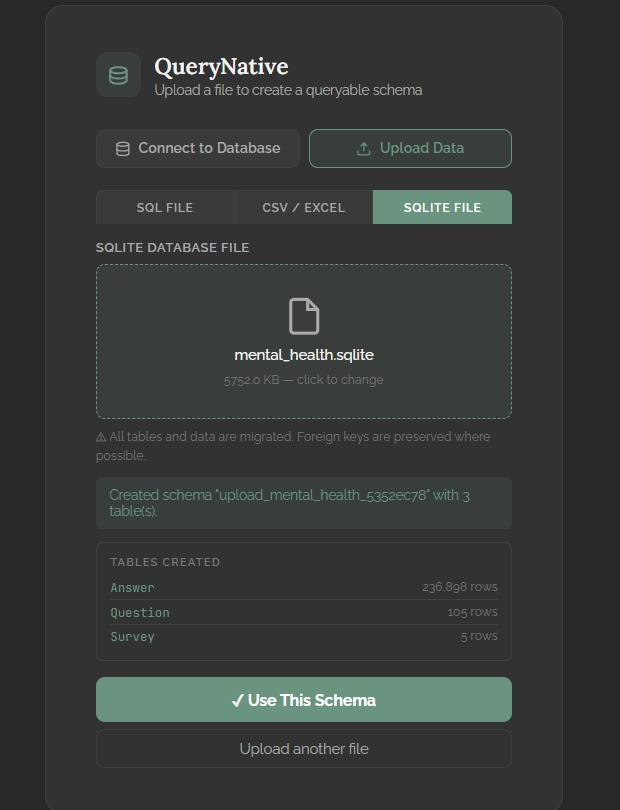
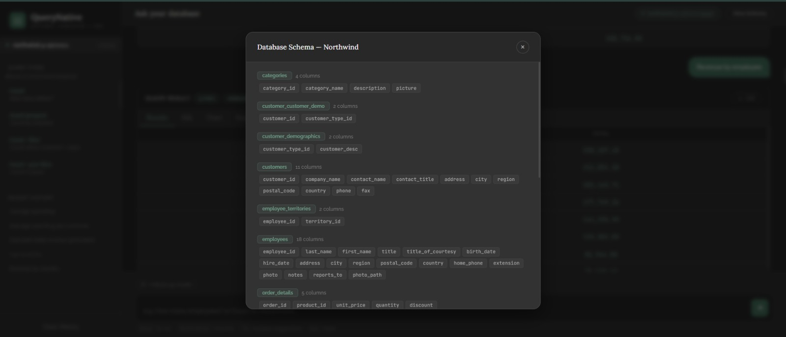
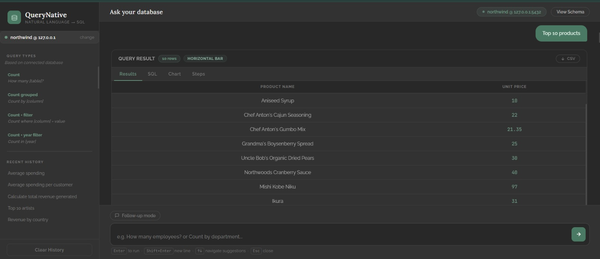
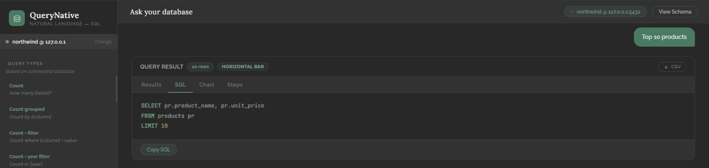
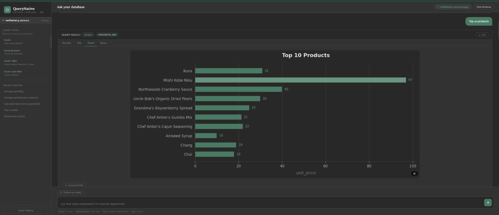
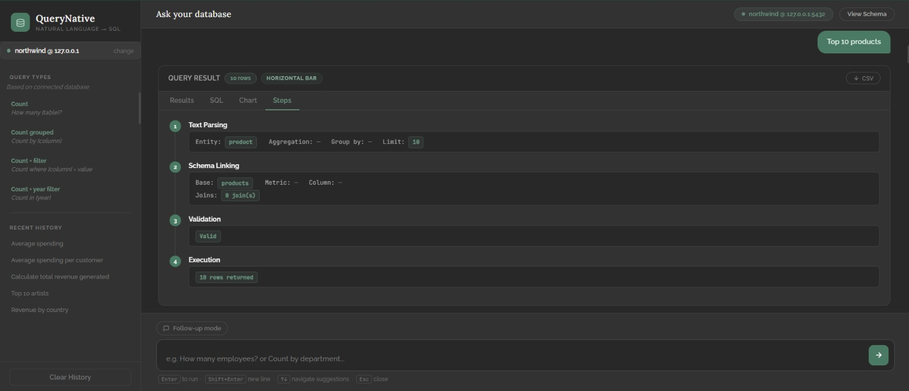

# QueryNative

### Natural Language → SQL → Data Insights

QueryNative is a schema-aware Natural Language to SQL (NL-to-SQL) system that allows users to interact with relational data using plain English instead of manually writing SQL.

The system processes a natural-language request, interprets the query intent, maps it to the available database schema, generates and validates SQL, executes the query, and presents the results in tabular and visual form.

> Academic project: **Query-Native: NL-to-SQL Engine**

## Features

- **Natural Language Querying** — Ask database questions using plain English.
- **LLM-assisted Query Understanding** — Uses the Groq API for natural-language query processing.
- **Dynamic Schema Discovery** — Discovers available tables, columns, and relationships.
- **Schema Linking** — Maps user terminology to database tables and columns.
- **SQL Generation** — Converts interpreted requests into SQL queries.
- **SQL Validation** — Restricts database interaction to safe, read-only queries.
- **Database & File Ingestion** — Supports PostgreSQL and local database/data-file workflows implemented in the project.
- **Result Visualization** — Presents query results in tabular form and through charts.
- **Processing Transparency** — Provides visibility into stages such as text parsing, schema linking, validation, and execution.

## Demo

### 1. Database Upload



QueryNative can ingest a database file and generate a queryable schema.

### 2. Database Schema



The schema interface displays available tables and columns before querying.

### 3. Natural Language Query Results



Users can submit natural-language questions and view the resulting data in a structured table.

### 4. Generated SQL



The generated SQL is displayed so users can inspect how the natural-language request was translated.

### 5. Smart Visualization



Query results can be represented visually through charts for easier interpretation.

### 6. Processing Steps



The application exposes the processing pipeline, including text parsing, schema linking, validation, and execution.

## How It Works

```text
Natural Language Query
          ↓
    Query Processing
          ↓
    Schema Discovery
          ↓
     Schema Linking
          ↓
     SQL Generation
          ↓
     SQL Validation
          ↓
    Query Execution
          ↓
 Results + Visualization
```

## System Architecture

```text
                         USER
                           │
                           ▼
                Natural Language Query
                           │
                           ▼
                 ┌─────────────────┐
                 │ Query Processing│
                 └────────┬────────┘
                          │
                          ▼
                 ┌─────────────────┐
                 │ Schema Discovery│
                 └────────┬────────┘
                          │
                          ▼
                 ┌─────────────────┐
                 │  Schema Linking │
                 └────────┬────────┘
                          │
                          ▼
                 ┌─────────────────┐
                 │  SQL Generation │
                 └────────┬────────┘
                          │
                          ▼
                 ┌─────────────────┐
                 │  SQL Validation │
                 └────────┬────────┘
                          │
                          ▼
                 ┌─────────────────┐
                 │ Query Execution │
                 └────────┬────────┘
                          │
                          ▼
                 ┌─────────────────┐
                 │ Results & Charts│
                 └─────────────────┘
```

## Tech Stack

| Layer | Technology |
|---|---|
| Language | Python |
| Backend | Flask |
| NLP / LLM | Groq API |
| Database | PostgreSQL |
| Local Querying | SQLite |
| Data Processing | Pandas |
| SQL Layer | SQLAlchemy / PostgreSQL tooling |
| Visualization | Matplotlib |
| Frontend | HTML, CSS, JavaScript |
| Configuration | python-dotenv |
| Development | Visual Studio Code |

## Project Structure

```text
QueryNative/
│
├── app.py
├── main.py
├── run.py
├── upload_handler.py
├── requirements.txt
├── .env.example
├── .gitignore
│
├── db/
│   ├── db_connection.py
│   ├── schema_catalog.py
│   ├── schema_discovery.py
│   └── schema_map.py
│
├── nlp/
│   ├── groq_parser.py
│   └── text_parser.py
│
├── schema/
│   └── schema_linker.py
│
├── sql_engine/
│   ├── query_builder.py
│   ├── query_validator.py
│   └── sql_executor.py
│
├── visualizer/
│   └── visualize.py
│
├── templates/
│   └── index.html
│
└── assets/
    └── screenshots/
```

## Installation

### 1. Clone the repository

```bash
git clone https://github.com/mansinavingupta/QueryNative.git
cd QueryNative
```

### 2. Create a virtual environment

```bash
python -m venv venv
```

**Windows:**

```powershell
venv\Scripts\activate
```

### 3. Install dependencies

```bash
pip install -r requirements.txt
```

### 4. Configure the API key

Create a `.env` file in the project root:

```env
GROQ_API_KEY=your_groq_api_key_here
```

A `.env.example` template is included in the repository.

**Never commit the real `.env` file or expose an API key publicly.**

### 5. Run the application

```bash
python run.py
```

Then open:

```text
http://127.0.0.1:5000
```

## Query Safety

The project is designed for read-only database interaction. Its documented scope restricts database operations to `SELECT` queries and excludes operations that modify, insert, or delete records.

## Project Objectives

- Convert natural-language queries into SQL.
- Make structured data easier to access for non-technical users.
- Dynamically discover database schemas.
- Validate generated SQL before execution.
- Present query results through tables and visualizations.

## Future Scope

Potential extensions include multilingual queries, advanced analytics, broader database support, and more sophisticated conversational capabilities.

## Team

**Mansi Gupta · Nakshi Goda · Anvayee Gondhali · Riya Gupta**

**Guide:** Dr. Rushikesh Nikam

**Department of Computer Engineering — A. P. Shah Institute of Technology**


